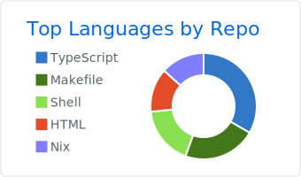

# Gamou Tatsumi

<p align="left"> 
  <a href="https://github.com/gamoutatsumi/gamoutatsumi/">
    
  </a>
  <a href="http://twitter.com/gamoutatsumi">
    
  </a>
  <a href="https://github.com/gamoutatsumi">
    
  </a>
</p>



## Twitter Activity


### Analysis

<!--START_SECTION:waka-->
```text
Markdown     8 hrs 46 mins   ████████░░░░░░░░░░░░░░░░░   32.01 % 
TypeScript   8 hrs 6 mins    ███████▒░░░░░░░░░░░░░░░░░   29.61 % 
YAML         3 hrs 12 mins   ███░░░░░░░░░░░░░░░░░░░░░░   11.72 % 
JavaScript   1 hr 35 mins    █▒░░░░░░░░░░░░░░░░░░░░░░░   05.79 % 
Other        1 hr 25 mins    █▒░░░░░░░░░░░░░░░░░░░░░░░   05.21 % 
```
<!--END_SECTION:waka-->

[](https://github.com/gamoutatsumi/gamoutatsumi/actions?query=workflow%3AWaka-Readme) [](https://github.com/gamoutatsumi/gamoutatsumi/actions?query=workflow%3AGitHub-Profile-Summary-Cards) [](https://github.com/gamoutatsumi/tweet_pixels/actions?query=workflow%3Atweet_pixel_yesterday) [](https://github.com/gamoutatsumi/tweet_pixels/actions?query=workflow%3Atweet_pixel_today)
